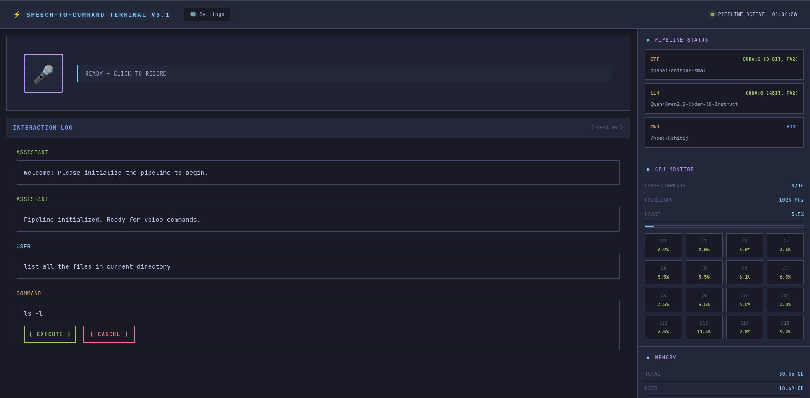
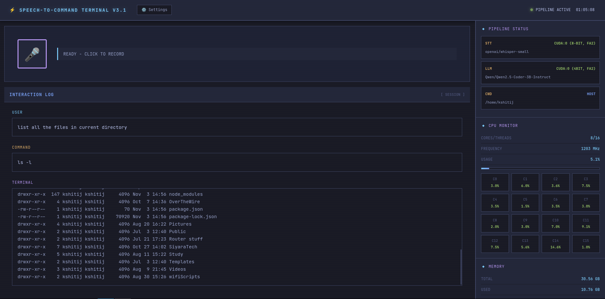
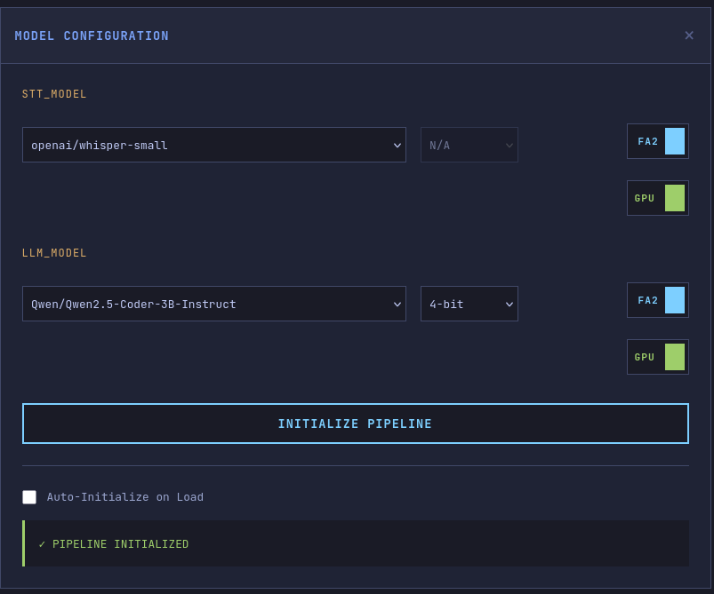

# ⚡ Speech-to-Command Terminal (S2C)

This project is a full-stack, self-hosted web application that translates your voice commands directly into executable shell commands. It features a real-time system monitor and an interactive, 'hacker'-style terminal interface, all powered by a local AI pipeline.

Speak naturally (e.g., *"show me all files in the downloads folder"*) and watch as it's translated into the correct command (`ls -l ~/Downloads`), ready for you to approve and execute.


## Images







## Core Features

* **Voice-to-Command Pipeline:** An end-to-end system that transcribes your speech (STT) and then uses an LLM to intelligently convert your natural language request into a valid shell command.
* **Interactive Web Terminal:** A single-page Flask application with a terminal UI to record audio, view interaction logs, and confirm command execution.
* **Human-in-the-Loop Safety:** All generated commands require a manual "Execute" confirmation from the user before running.
* **Stateful Terminal:** Remembers your current working directory (CWD) across commands, correctly handling `cd` operations.
* **Real-time System Monitor:** A live-updating side panel displays detailed stats for:
    * CPU (per-core usage, frequency)
    * GPU (NVIDIA) (load, memory, temperature)
    * Memory (RAM)
    * Storage (Disk)
    * Top Processes
* **High-Performance AI:**
    * **STT:** Uses `transformers` with `openai/whisper` models for fast, accurate speech recognition.
    * **LLM:** Leverages a local instruction-tuned LLM (e.g., `Qwen/Qwen2.5-Coder-3B-Instruct`, `meta-llama/Llama-3.2-1B-Instruct`) for robust natural language-to-shell translation.
* **Advanced Model Optimization:** Configure models directly from the UI to use:
    * **4-bit/8-bit Quantization** (`bitsandbytes`)
    * **Flash Attention 2**
    * **GPU/CPU assignment** for each model, allowing you to run large models on consumer-grade hardware.

## How It Works: The Pipeline

1.  **Frontend (UI):** The user clicks the microphone button in the browser (`index.html`). The `MediaRecorder` API captures audio.
2.  **Audio Transmission:** The audio (as a Base64 string) is sent to the Flask backend's `/api/process_audio` endpoint.
3.  **STT Service (`stt.py`):** The backend `SpeechToSpeechPipeline` passes the audio to the STT service. It uses `librosa` for processing and a Whisper model to transcribe the audio into text.
4.  **LLM Service (`llm.py`):** The transcribed text and the `TerminalExecutor`'s current CWD are passed to the LLM service.
5.  **Prompt Engineering (`config.py`):** The LLM uses a specific system prompt (`LLM_SYSTEM_PROMPT`) to format its response as a JSON object: `{"type": "command", "command": "...", "thought": "..."}`.
6.  **Response to UI:** The backend sends this JSON object back to the frontend.
7.  **User Confirmation (UI):** The frontend parses the JSON. If it's a "command," it displays the command string and "Execute" / "Cancel" buttons.
8.  **Command Execution:** If the user clicks "Execute," the command is sent to the `/api/execute_command` endpoint.
9.  **Terminal Executor (`terminal_executor.py`):** The `TerminalExecutor` class receives the command.
    * If it's a `cd` command, it updates its internal CWD state.
    * For any other command, it uses `subprocess.run` to execute it within the current CWD, capturing `stdout` and `stderr`.
10. **Final Output:** The command's output is sent back to the frontend and displayed in the interaction log.
11. **Monitoring:** Simultaneously, the frontend polls the `/api/system_info` endpoint every 2 seconds to update the system monitor panel.

## Getting Started

### Prerequisites

* **Python >= 3.13** (as specified in `pyproject.toml`)
* [**`uv`**](https://github.com/astral-sh/uv) (or `pip`) for package management.
* **NVIDIA GPU (Recommended)** with CUDA drivers installed to run models with decent performance.
* **Microphone** for audio input.

### Installation

1.  Clone the repository:
    ```bash
    git clone https://github.com/KshitijTardalkar/capstone
    cd capstone
    ```

2.  Create and activate a virtual environment:
    ```bash
    python3.13 -m venv .venv
    source .venv/bin/activate
    ```

3.  Install the required dependencies using `uv` (or `pip`):
    ```bash
    # Using uv (recommended, uses pyproject.toml and uv.lock)
    uv sync

    # Using pip
    # pip install -e .
    ```

### Running the Application

1.  Run the Flask server:
    ```bash
    flask --app app run --debug --host=0.0.0.0 --port=5000
    ```

2.  Open your browser and navigate to `http://localhost:5000`.

3.  **Important:** On first load, a "Model Configuration" modal will appear.
    * Select the STT and LLM models you want to use.
    * Configure GPU, Quantization (e.g., 4-bit), and Flash Attention 2 based on your hardware.
    * Click **"Initialize Pipeline"**. This will download and load the models into memory, which may take several minutes.

4.  Once the "PIPELINE ACTIVE" status appears, you can click the microphone button to start giving commands.

## Configuration

* **Available Models:** To add or remove models from the UI dropdowns, edit the `AVAILABLE_MODELS` dictionary in `config.py`.
* **LLM Prompting:** The core logic for how the LLM translates text to commands can be modified by editing the `LLM_SYSTEM_PROMPT` in `config.py`.

## Project Structure
```
.
├── app.py                  # Main Flask server and API endpoints
├── config.py               # Model lists and LLM system prompt
├── pyproject.toml          # Project definition and dependencies
├── uv.lock                 # Pinned dependencies
├── services/
│   ├── terminal_executor.py  # Handles safe command execution and CWD state
│   └── speech_to_speech/
│       ├── pipeline.py     # Manages loading/unloading of STT & LLM models
│       ├── helper.py       # Abstract base class for AI models
│       ├── stt.py          # Speech-to-Text (Whisper) service
│       ├── llm.py          # LLM (Command Generation) service
│       └── audio_utils.py  # Audio processing (resampling, trimming)
└── templates/
    └── index.html          # The complete frontend (HTML/CSS/JS)
```
